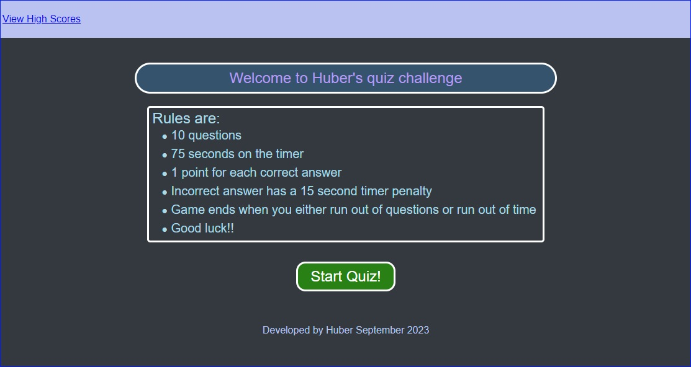

# Quiz-Game by Huber Heats

## Description

This website is a Quiz Game that is based on Javascript coding knowledge

When started, the user is presented with multiple choice questions to select answers for.

The rules are:
* There are 10 questions
* You have 75 seconds to work through them
* 1 point for each correct answer
* Incorrect answers attract a 15 second timer penalty
* The game ends when you have reached the end of the 10 questions or if you have run out of time

The allows entering your initials to capture your score. You'll be presented with the high scores once you've submitted your initials. 

Note: this Quiz Game has been created from scratch guided by the below user story and acceptance criteria.

## User Story

```
AS A coding boot camp student
I WANT to take a timed quiz on JavaScript fundamentals that stores high scores
SO THAT I can gauge my progress compared to my peers
```
<p align="right">(<a href="#readme-top">back to top</a>)</p>

## Acceptance Criteria

```
GIVEN I am taking a code quiz

WHEN I click the start button
THEN a timer starts and I am presented with a question

WHEN I answer a question
THEN I am presented with another question

WHEN I answer a question incorrectly
THEN time is subtracted from the clock

WHEN all questions are answered or the timer reaches 0
THEN the game is over

WHEN the game is over
THEN I can save my initials and my score

```
<p align="right">(<a href="#readme-top">back to top</a>)</p>

## Screenshot

The following are screenshots of the web application's appearance




<p align="right">(<a href="#readme-top">back to top</a>)</p>

## Installation

Cloning the repo is the only step required.

<p align="right">(<a href="#readme-top">back to top</a>)</p>


## Usage

Link to deployed website is found here:
* https://hybee234.github.io/quiz-game/
  
index.html, script.js and style.css files can be opened in Visual Studio Code

<p align="right">(<a href="#readme-top">back to top</a>)</p>
 

## Credits
Othneildrew - for the example on linking back to the top of the readme page!

<p align="right">(<a href="#readme-top">back to top</a>)</p>

## License

Please refer to the LICENSE in the repo.
<p align="right">(<a href="#readme-top">back to top</a>)</p>

## Badges

N/A
<p align="right">(<a href="#readme-top">back to top</a>)</p>

## Features

Extensive console logging has been embeeded across the application to capture important events:
* Functions being called
* Listener evenst being triggered
* Hide/Show Changes
* Calculations etc.

Extensive effort was invested into meaningful:
* Commentary in the script.js, style.css files

I hope this makes for easier review for anyone taking a closer look. Appreciate any feedback

<p align="right">(<a href="#readme-top">back to top</a>)</p>

## How to Contribute

N/A
<p align="right">(<a href="#readme-top">back to top</a>)</p>

## Tests

### Application specific:
* Validate that the main page has the View High Scores link
* Validate that hovering over "Start Quiz" changes the background slightly so that the user is aware this is a button
* Validate that hovering over "View High Scores" link makes the text more bold so that the user is aware this is a link
* Validate that  clicking "Start Quiz" launches you into the Quiz
	* Validate that the "View high scores" link, Start Quiz button and blurb is hidden from view
	* Validate that a timer is made visible with 75 seconds and counts down
		* Validate that the timer font is in green when above 30 seconds
		* Validate that the timer font turns orange below 30 seconds
		* Validate that the timer font turns red below 10 seconds
	* Validate that Questions are presented with 4 possible responses
		* Validate that the responses change colour on hover
		* Validate that clicking on any response will move the quiz onto the next question.
	* Validate that the quiz indicates have a selected response is correct or incorrect
		* Validate that the "Correct" and "Incorrect" formatting  is different - correct being a green theme, incorrect being red theme
		* Validate that the "Correct"/"Incorrect" pop up remains for 1 second before disappearing
	* Validate that an incorrect answer results in a 15 second time penalty
	* Validate that the quiz has a 1 second pause at the end of the last question to allow time for the "Correct"/"Incorrect" pop up to disappear before the next screen is rendered
* Validate that the game ends in one of two conditions
	* When the timer is less than or equal to zero OR
	* When the user has answered all questions
		* Validate that once the user has answered all questions, that the timer stops
* Validate that when the game ends, the banner text presented matches the way the game has ended
	* When the game ends based on timer the banner is expected to read " You have run out of time!"
	* When the game ends with the user exhausting all questions the banner is expected to read "Well Done! You've Completed the Quiz!"
* Validate that when the quiz ends, the elements used to display the multiple choice responses to questions are hidden
* Validate that when the quiz ends, the user is presented with their score
* Validate that when the quiz ends, the user is asked to submit their initials to appear in the high score
* Validate that when the quiz ends, if the user attempts to submit a blank initial, that the quiz does not proceed. The initials field will turn yellow for 1 second to highlight the mandatory field
* Validate that when the user submits their initials, that the "High Scores" screen is rendered
	* Validate that the "High Scores" screen displays all records in a column
	* Validate that hovering over the "Clear' and "Start Again" buttons changes their background to indicate it is a button
	* Validate that clicking on the "Clear" button clears all "High Scores"
	* Validate that clicking on the "Start Again!" button brings the user back to the home page
	
* Validate that if you click on "View High Scores" from the main page - that you are presented with the "Hi Scores Page"
	* Validate that there is a "Clear" and a "Back to Home" page (Note that the "Back to Home" and "Start Again!" buttons are technically the same button - the text dynamically changes depending on how the user arrives at the High Score page.)
        * If the user is presented with High scores at the end of the game - the button will read "Start Again!"
		* If the user accesses the High scores page by clicking on "View High Scores" then it should read "Back to Home"

### Developer practice tests:
* Validate that the application deployed at the live URL (https://hybee234.github.io/quiz-game/)
* Validate that the webpage loaded without errors
* Validate that GitHub URL has been submitted
* Validate that GitHub repository contains application code
* Validate that the application resembles mock-up provided in the challenge instructions
* Validate that the GitHub repository has a unique name
* Validate that the GitHub repostiory followed be practice for class/id naming conventions, indentation, quality comments, etc
* Validate that the repository contains multiple descriptive commit messages
* Validate that the repository contains a quality README file with description, screenshot and link to deployed applications
<p align="right">(<a href="#readme-top">back to top</a>)</p>
